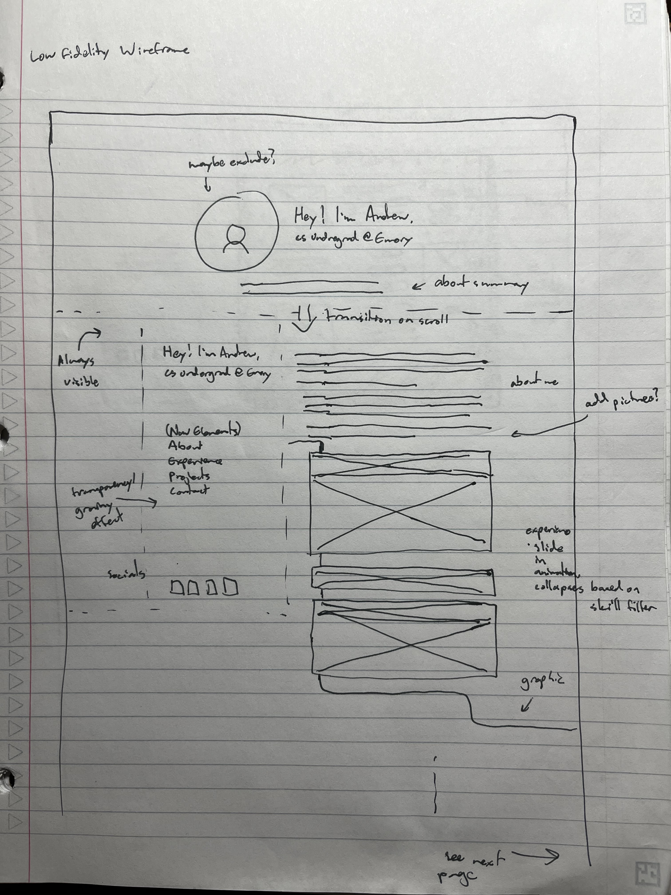
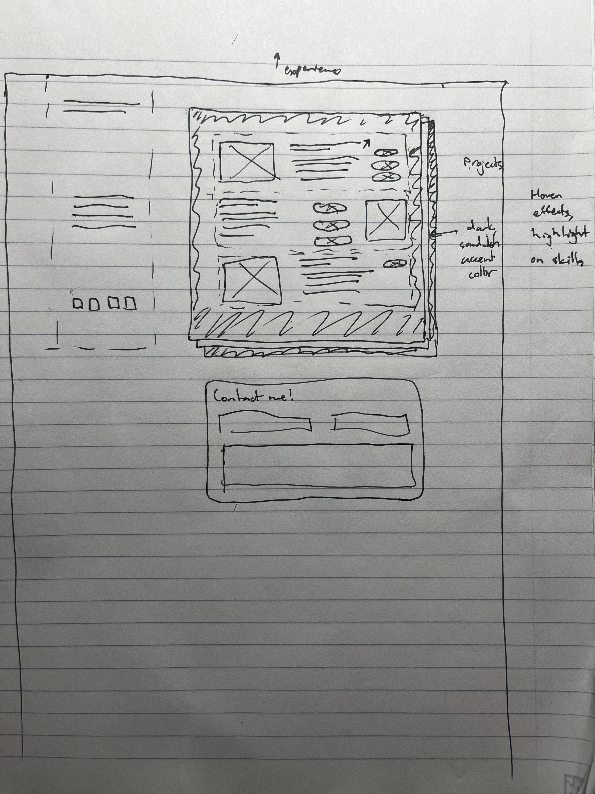
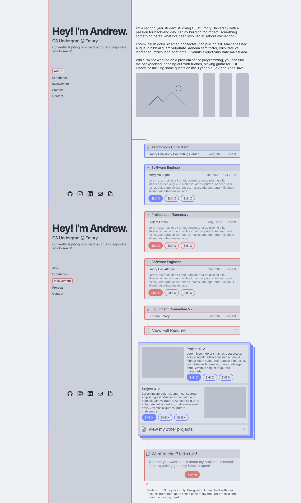
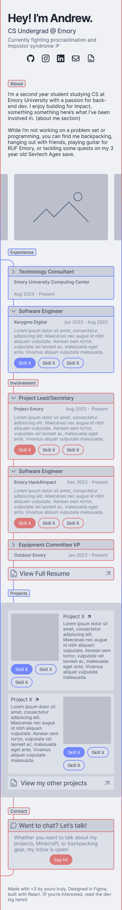

tags: website_dev_log

# Components and Design
## 01-04-24 to 01-12-24

### Progress
Wanting to get out of my sketching block, I moved on to to the design stage and began creating components, compiling good vibes, and testing different color combos. I ended up only finishing a singular component but stumbled upon a banger of a [youtube video](https://youtu.be/83j3Z4heXH0?si=6BqdKGVfGKeHDXFv) that got the creative juices flowing and also provided some good insight on the design process, backtrack a bit and follow the video's progress. 

I quickly compiled some example sites that I wanted to draw inspiration from onto a mood board, did some more wireframing on paper (add picture), and created two mid-fidelity sketches on Figma. On a side note, components are extremely helpful, and the ability to rapidly switch between styles was amazing for productivity (though it did take forever to figure out how to use them properly).

**Paper Wireframe:**
| Page 1 | Page 2 |
| --- | --- |
|  |  |

**Sketches:**
| Desktop Sketch | Mobile Sketch |
| --- | --- |
|  |  |

For now, I settled on a design with opening and closing panes depending on selected skills to focus on (in the form of clickable buttons on each pane), though this may hinder user experience as closing panes would limit users' abilities to select multiple skills across different experiences/projects and too many closing panes may put the user at the very bottom at the website. However, replacing closing panes with an opacity modifier would be quite simple, and all else that would need to be done is changing the little arrow dropdown icon. (I also made the transparent components, just in case, and I'm sure retaining the viewport's position on the page to fix the latter issue would also be relatively simple.)

Finally, I reached out to a couple of friends to get initial thoughts - they were kind enough to agree, and from their initial feedback I decided to abandon a light/dark swap in the middle of the page in favor of a light theme throughout and only two accent colors. One also made sure to mention that animations and transitions were key. I'll be getting more feedback once I have a working website. However, this will suffice for now.

### TODOs:
Checked off most of UI/UX/Design, skipping a final design draft as I want to start building and the mid-fidelity sketch accomplishes most of what the design phase was supposed to do: cohesive styling guides. Excited to start building tomorrow!
- [ ] UI/UX/Design
  - [x] Figma setup (pages, thumbnail)
  - [x] Wireframing
    - [x] User flow diagram
    - [x] Single page sketch
  - [x] Other design stuff
    - [x] Colors
    - [x] Components
    - [x] Vibes
  - [ ] Feedback
- [ ] Implementation
  - [ ] Export palette and other design elements for consistency
  - [x] Setup (pnpm, ts, create vite)
  - [ ] Pages
  - [ ] Components
  - [ ] Responsive design
  - [ ] Flashy features to impress visitors
  - [ ] Idk

**\- andrewtlu 01-04-23**

P.S once I have more time I'd like to experiment with a [hand-drawn style](https://www.youtube.com/watch?v=HJleHPVpBJw) for my personal website w/ one of my old lego figure 3d models (and potentially three.js) - adding this to my list of future todos.