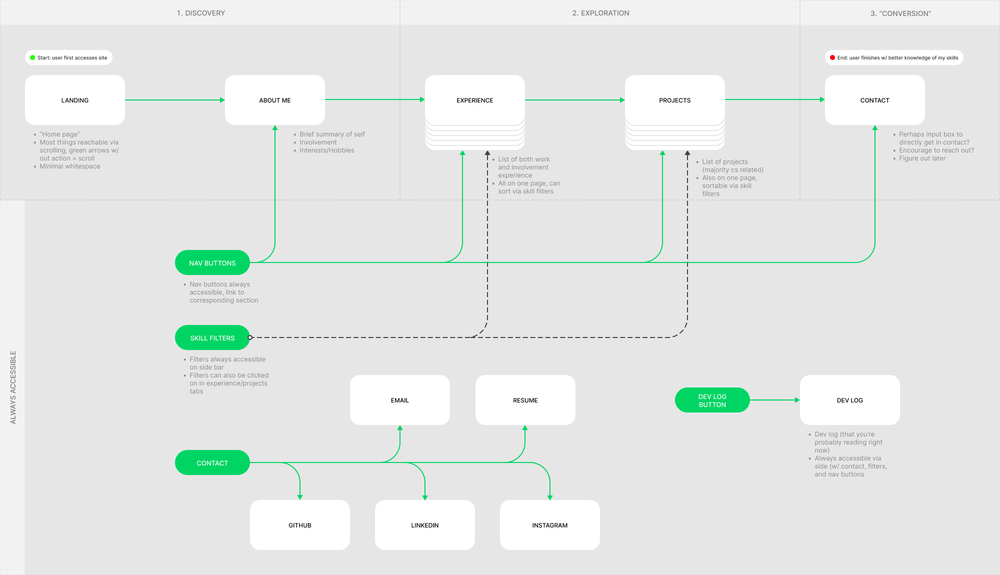
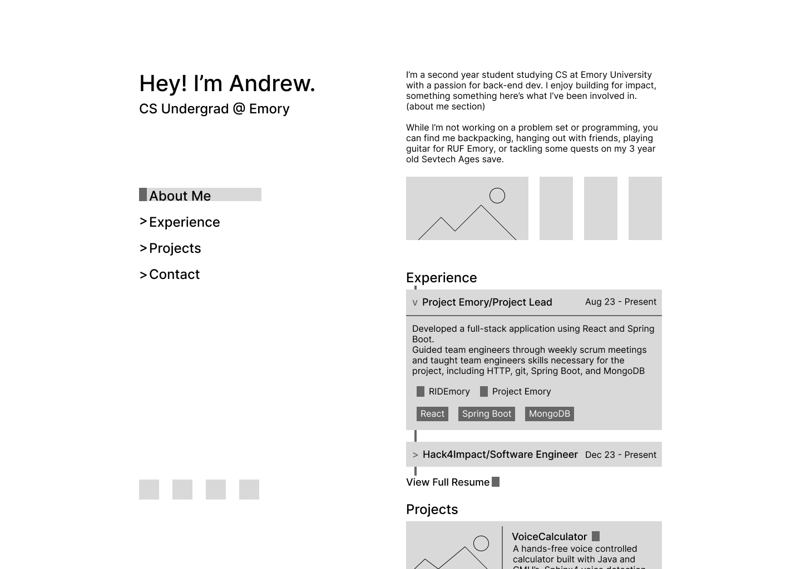
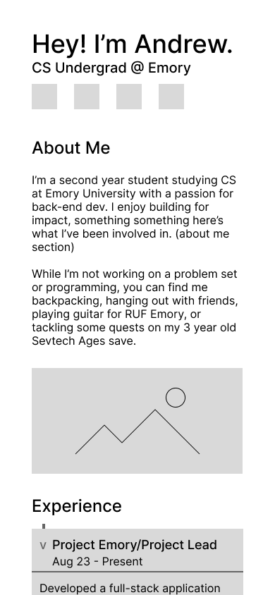

tags: website_dev_log

# Basic Setup and Wireframing
## 12-28-23 to 01-04-24

### Progress
I began reading up on the design process ([here](https://www.netguru.com/resources/design-process)) today. Though it may seem overkill for my personal website, I've already found a lot of it to be things I wouldn't have thought about prior:
* Problem-focused:
  * I figured my website just needed to look cool, but some of my older sketches were way too convoluted and did not do what I wanted my personal website to do: give visitors a easily accessible overview of my skills (limited as they are atm :sweat_smile:, though this is definitely a step in the right direction)
  * I'll be scrapping my older designs in favor for a much more slim website and trying to implement cool features around this goal, rather than letting features bloat and convolute any visitors' experience
* Design testing
  * Though I don't know recruiters I can ask feedback from, I figured I'd talk to a few friends and get them to look over the design once I completed it to catch any bad design choices I might make
  * If I remember, I'll get back with pieces of feedback once I actually have some

I then walked through the various design steps, asking myself questions that a UI/UX designer might ask a client, of which included:
* *What's my goal?* Market myself as a capable software engineer and a decent person
* *Have I done user research?* Nope, but I know the target demographic is probably recruiters and the end goal is to leave them with a good impression of myself
* *Do I have specific branding or style guides?* Nope, whatever looks unique and cool but isn't over the top, accentuates my backend experience, and maybe works in blue colors
* *What's the goal with an MVP?* Not quite sure yet, perhaps a functional landing page
* *Are there any time restrictions?* Given I've taken a long enough break, decent progress before the spring semester starts :)

Finally, I got to work in Figma, found an example page setup, and created [my design file](https://www.figma.com/file/JnrF4bZd49wXQkqQt8gn4y/Personal-Website?type=design&node-id=8%3A2&mode=design&t=kViVxYoSgkOKTT5u-1). Then, I created a simple user flow diagram including the four sections I want to include on the website (about, experience, projects, and blog):

At this point, I decided to save some time by skipping the flow chart stage as basically everything would occur on the same page, and I began working on a page sketch, paired with some best-practice info regarding layout grids, to attempt to finalize my page structure:

| Desktop Sketch | Mobile Sketch |
| --- | --- |
|  |  |

While trying to figure out a layout for the page, I hit a bit of a block and so I decided I'll leave the sketches here in favor of figuring out some components and colors.

### TODOs:
Given this progress, my TODO list looks like this now:
- [ ] UI/UX/Design
  - [x] Figma setup (pages, thumbnail)
  - [x] Wireframing
    - [x] User flow diagram
    - [x] Single page sketch
  - [ ] Other design stuff
    - [ ] Colors
    - [ ] Components
    - [ ] Vibes
  - [ ] Final design draft
  - [ ] Feedback
- [ ] Implementation
  - [ ] Export palette and other design elements for consistency
  - [x] Setup (pnpm, ts, create vite)
  - [ ] Pages
  - [ ] Components
  - [ ] Responsive design
  - [ ] Flashy features to impress visitors
  - [ ] Idk

**\- andrewtlu 01-04-23**
